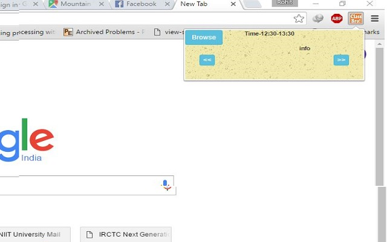
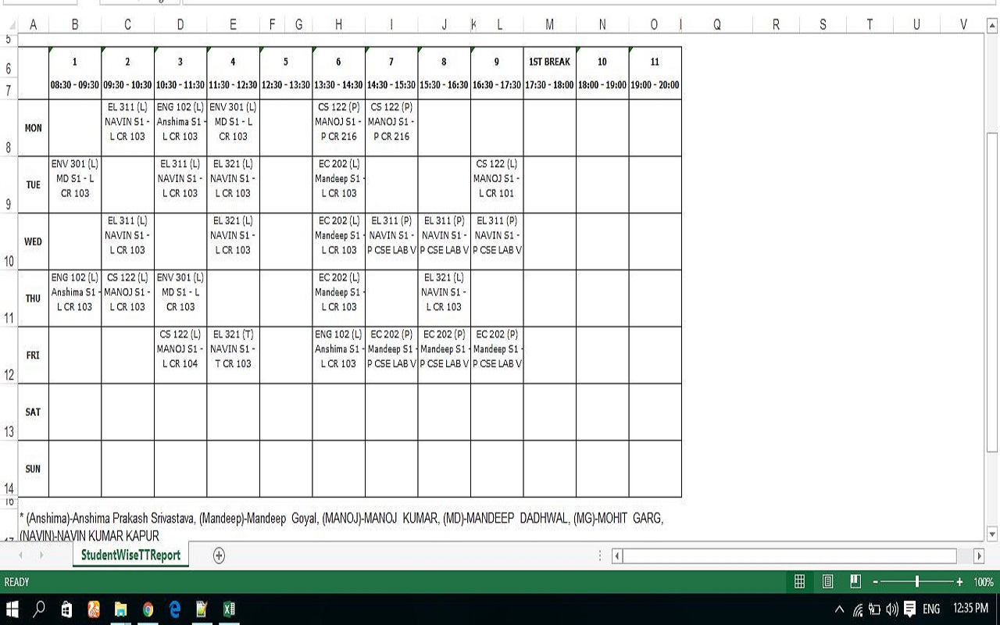

# Class Reminder

---
a chrome extension that parse the excel file(xls.js) given by the user by clicking on the popup page later this
file is stored in chrome using chrome storage api.

---
popup page
---

---

---
